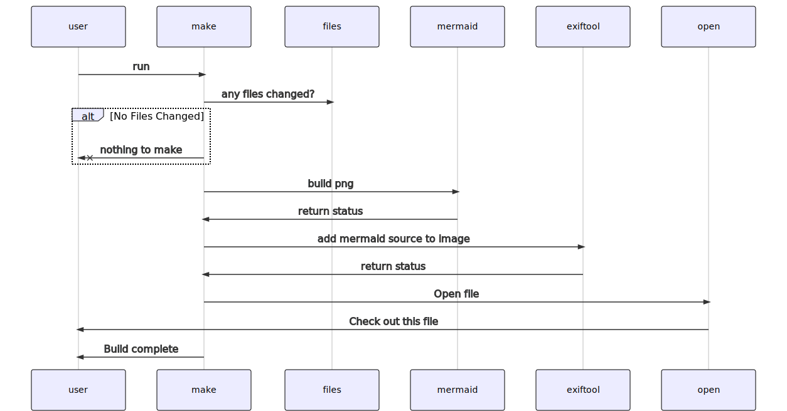

# Enhancement Proposals

This folder contains the Enhancement Proposals for `bldr`.  They are intended to work very similarly to Python's Enhancement Proposals.  Any proposed change should be submitted via a Merge Request so discussion can be captured.

## Tutorial

For a general overview of `bldr` see [Tutorial](tutorial.md)

## EP Format

Each Enhancement Proposal should be a simple Markdown Document.  And supporting images should be placed in a 
sub directory of matching name.

```
ep-1234.md -> ep-1234/<files go here>
```

Note that Gitlab supports using Mermaid JS to add inline diagrams.  See 
https://mermaid-js.github.io/mermaid/#/


## Index

| Proposal   | Title                                                             |
| ---------: | ----------------------------------------------------------------- |
| 0001       | [Project Goals](ep-0001.md)                                       |
| 0005       | [bldr Command](ep-0002.md)                                        |
| 0006       | [bldr Command - Templates](ep-0003.md)                            |

# Appendix

## Mermaid Diagrams - https://mermaid-js.github.io/mermaid/#/


Generate diagrams from mermaid descriptions.

Use NPM to install the tool
```
npm install
```

To update any .mmd files to .svg, run make 
```
make
```

To use a diagram in a md, reference its .svg:

```

```

For more info see: https://serialized.net/2019/08/mermaid/